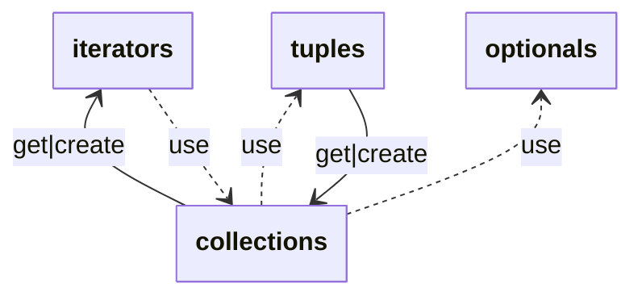
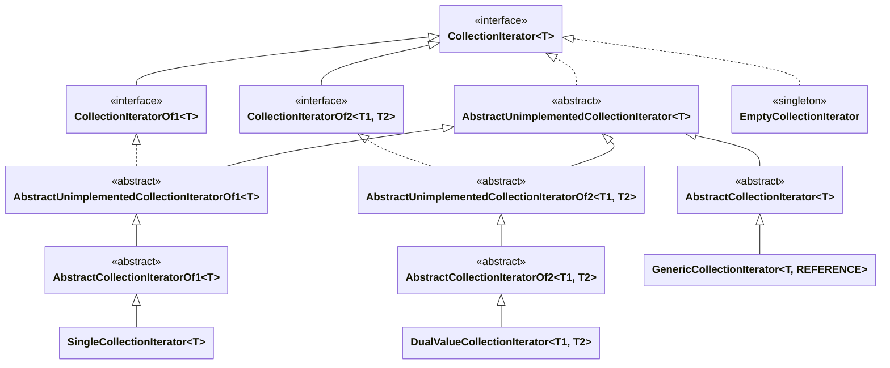
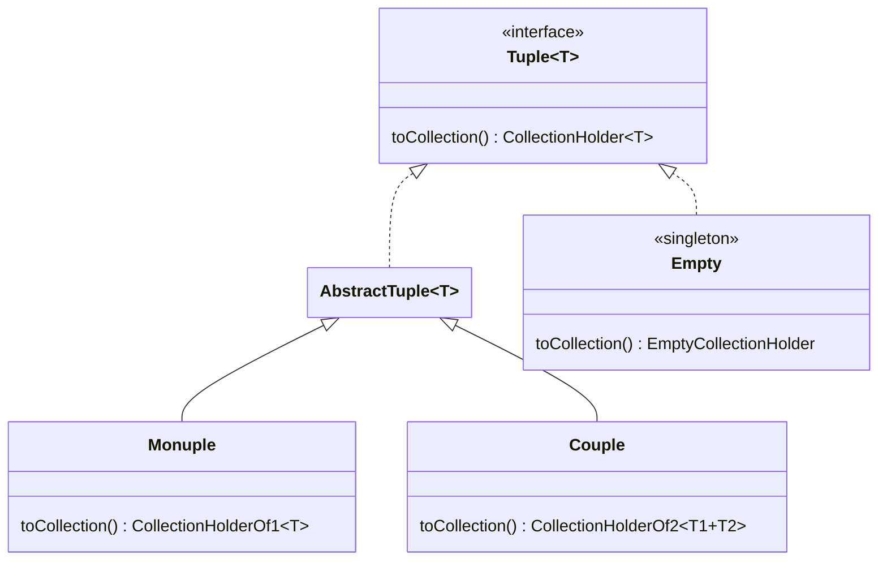
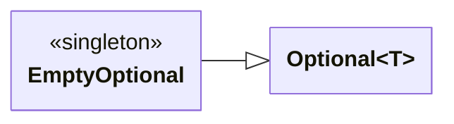

# Collection (javascript version)
[![version][npm-image-link]][npm-link]
[![downloads][npm-download-image-link]][npm-download-link]

[npm-image-link]:          https://img.shields.io/npm/v/@joookiwi/collection.svg?logo=npm&label=
[npm-link]:                https://npmjs.org/package/@joookiwi/collection
[npm-download-image-link]: https://img.shields.io/npm/dt/@joookiwi/collection.svg
[npm-download-link]:       https://npm-stat.com/charts.html?package=@joookiwi/collection

## Table of content
* [Installation](#installation)
* [Usage](#usage)
  * [The size methods](#the-size-methods)
  * [The research methods](#the-research-methods)
  * [The index methods](#the-index-methods)
  * [The validation methods](#the-validation-methods)
  * [The transformation methods](#the-transformation-methods)
  * [The loop methods](#the-loop-methods)
  * [The reordering methods](#the-reordering-methods)
  * [The conversion methods](#the-conversion-methods)
  * [The utility methods](#the-utility-methods)
  * [Non-present methods](#non-present-methods)
* [Additional](#additional)
  * [The tuples](#the-tuples)
  * [The optionals](#the-optionals)
* [Dependencies representation](#dependencies-representation)
  * [Iterators](#iterators)
  * [Tuples](#tuples)
  * [Optionals](#optionals)
  * [Collections](#collections)
* [Contribution](#contribution)

The way to think about this is to have the functionalities of other languages
(like `Java`, `PHP`, `C#`, `Kotlin` and even `Javascript`)
all in one standalone structure.

But, with a possible functional approach using the collections.

The structure is and will be in continuous change
to implement almost everything that the other languages have (if it is possible).

## Installation
```
npm install @joookiwi/collection
npm i @joookiwi/collection

npm install --save @joookiwi/collection
npm i -S @joookiwi/collection

npm install --save-dev @joookiwi/collection
npm i -D @joookiwi/collection
```

## Usage

In total, there are 28 instances to each a specialization (_all non-mutable_)
`CollectionHolder` or `MinimalistCollectionHolder`.
It can also be extended to the `CollectionHolderOf1` and `CollectionHolderOf2` for more specialization.

There are 2 different kinds of collections (_which are all non-mutable_).
- a minimalist (`GenericMinimalistCollectionHolder`),
- eager one (`GenericCollectionHolder`).

There are 11 different lazy collection instances
- generic for `LazyCollectionHolder`,
- 1 for `LazyCollectionHolderOf1`,
- 2 for `LazyCollectionHolderOf2`,
- 0|1 for `LazyCollectionHolderOf0Or1`,
- 0|1|2 for `LazyCollectionHolderOf0Or1Or2`,
- 1|2 for `LazyCollectionHolderOf1Or2`.
- array (`LazyArrayAsCollectionHolder`),
- set (`LazySetAsCollectionHolder`),
- iterator from the framework (`LazyIteratorAsCollectionHolder`),
- JavaScript iterator (`LazyJsIteratorAsCollectionHolder`),
- JavaScript iterable (`LazyJsIterableAsCollectionHolder`),

There are 12 adaptors instances for `Array`, `Set`, `CollectionIterator`, `Iterator` and `Iterable`
- minimalist (`MinimalistAsCollectionHolder`),
- array (`ArrayAsCollectionHolder`),
- array of 1 for `ArrayOf1AsCollectionHolder`,
- array of 2 for `ArrayOf2AsCollectionHolder`,
- set (`SetAsCollectionHolder`),
- set of 1 for `SetOf1AsCollectionHolder`,
- set of 2 for `SetOf2AsCollectionHolder`,
- iterator from the framework (`IteratorAsCollectionHolder`),
- iterator of 1 from the framework (`IteratorOf1AsCollectionHolder`),
- iterator of 2 from the framework (`IteratorOf2AsCollectionHolder`),
- JavaScript iterator (`JsIteratorAsCollectionHolder`),
- JavaScript iterable (`JsIterableAsCollectionHolder`).

There are 3 instances for specific amount of values
- 0 for `EmptyCollectionHolder` (<small>as a singleton</small>)
- 1 for `SingleValueCollectionHolder`
- 2 for `DualValueCollectionHolder`

And there are 2 instances only to view the instance without interference
- `MinimalistCollectionViewer`
- `CollectionViewer`

They can always be converted to
the `Array`, `Set`,
or even `Map` depending on the usage.

It can be separated in different categories.
1. The **size** methods
2. The **research** methods
3. The **index** methods
4. The **validation** methods
5. The **transformation** methods
6. The **loop** methods
7. The **reordering** methods
8. The **conversion** methods
9. Some **utility** methods _(not part of the `CollectionHolder`)_

---
### The size methods

Those methods are associated with a size or directly compared
 - `size`|`length`|`count`
 - `isEmpty`
 - `isNotEmpty`|`hasAtLeast1Element`|`includesAtLeast1Element`|`containsAtLeast1Element`
 - `hasAtMost1Element`|`includesAtMost1Element`|`containsAtMost1Element`
 - `hasAtLeast2Elements`|`includesAtLeast2Elements`|`containsAtLeast2Elements`
 - `hasExactly2Elements`|`includesExactly2Elements`|`containsExactly2Elements`
 - `hasAtMost2Elements`|`includesAtMost2Elements`|`containsAtMost2Elements`

### The research methods

Those methods are meant to find an element comparing it
or giving a value from the **collection**
 - get value
   - `get`|`at`|`elementAt`
   - `getFirst`|`first`|`firstIndexed`
   - `getLast`|`last`|`lastIndexed`
 - get value or else
   - `getOrElse`|`atOrElse`|`elementAtOrElse`
 - get value or null
   - `getOrNull`|`atOrNull`|`elementAtOrNull`
   - `getFirstOrNull`|`firstOrNull`|`firstIndexedOrNull`
   - `getLastOrNull`|`lastOrNull`|`lastIndexedOrNull`
 - find first value
   - `findFirst`|`find`|`first`
   - `findFirstOrNull`|`findOrNull`|`firstOrNull`
   - `findFirstIndexed`|`findIndexed`|`firstIndexed`
   - `findFirstIndexedOrNull`|`findIndexedOrNull`|`firstIndexedOrNull`
 - find last value
   - `findLast`|`last`
   - `findLastOrNull`|`lastOrNull`
   - `findLastIndexed`|`lastIndexed`
   - `findLastIndexedOrNull`|`lastIndexedOrNull`

### The index methods

Those methods are giving or finding index values in the **collection**
 - get index
   - `firstIndexOf`|`indexOf`
   - `firstIndexOfOrNull`|`indexOfOrNull`
   - `lastIndexOf`
   - `lastIndexOfOrNull`
 - find first index
   - `indexOfFirst`|`findFirstIndex`|`findIndex`
   - `indexOfFirstOrNull`|`findFirstIndexOrNull`|`findIndexOrNull`
   - `indexOfFirstIndexed`|`findFirstIndexIndexed`|`findIndexIndexed`
   - `indexOfFirstIndexedOrNull`|`findFirstIndexIndexedOrNull`|`findIndexIndexedOrNull`
 - find last index
   - `indexOfLast`|`findLastIndex`
   - `indexOfLastOrNull`|`findLastIndexOrNull`
   - `indexOfLastIndexed`|`findLastIndexIndexed`
   - `indexOfLastIndexedOrNull`|`findLastIndexIndexedOrNull`

### The validation methods

Those methods are to give a validation on some type, value
or comparison across the **collection**
 -
   - `all`|`every`
   - `any`|`some`
   - `none`
 - has …
   - `hasNull`|`includesNull`|`containsNull`
   - `hasDuplicate`|`includesDuplicate`|`containsDuplicate`
   - `has`|`includes`|`contains`
   - `hasNot`|`includesNot`|`containsNot`
   - `hasOne`|`includesOne`|`containsOne`
   - `hasNotOne`|`includesNotOne`|`containsNotOne`
   - `hasAll`|`includesAll`|`containsAll`
   - `hasNotAll`|`includesNotAll`|`containsNotAll`
 - `requireNotNull`

### The transformation methods

Those methods have the purpose to give a new **collection** 
with a possibly different type from the original **collection**
 - filter …
   - `filter`
   - `filterIndexed`
   - `filterNot`
   - `filterIndexedNot`
   - `filterNotNull`
 - slice …
   - `slice`
 - take …
   - `take`|`limit`
   - `takeWhile`|`limitWhile`
   - `takeWhileIndexed`|`limitWhileIndexed`
   - `takeLast`|`limitLast`
   - `takeLastWhile`|`limitLastWhile`
   - `takeLastWhileIndexed`|`limitLastWhileIndexed`
 - drop …
   - `drop`|`skip`
   - `dropWhile`|`skipWhile`
   - `dropWhileIndexed`|`skipWhileIndexed`
   - `dropLast`|`skipLast`
   - `dropLastWhile`|`skipLastWhile`
   - `dropLastWhileIndexed`|`skipLastWhileIndexed`
 - map …
   - `map`
   - `mapIndexed`
   - `mapNotNull`
   - `mapNotNullIndexed`

### The loop methods

Those methods are just doing a basic loop on the **collection**
 - `forEach`
 - `forEachIndexed`
 - `onEach`
 - `onEachIndexed`

### The reordering methods

Those methods are just changing the order to the elements of the **collection**
 - `toReverse`|`toReversed`|`reversed`

### The conversion methods

Those methods have the sole purpose to convert the structure from a **collection**
to another structure.
It can also convert the value to a **string**.
 - `toIterator`
 - `toArray`
 - `toMutableArray`
 - `toSet`
 - `toMutableSet`
 - `toWeakSet` (_only if the it is an `object`|`symbol` or in `GenericObjectCollectionHolder`_)
 - `toMutableWeakSet` (_only if it is an `object`|`symbol` or in `GenericObjectCollectionHolder`_)
 - `toMap`
 - `toMutableMap`
 - `toString`
 - `toLocaleString`
 - `toLowerCaseString`
 - `toLocaleLowerCaseString`
 - `toUpperCaseString`
 - `toLocaleUpperCaseString`
 - `joinToString`|`join`

### The utility methods

Those methods are not part of the `CollectionHolder`,
but are a complement to the overall robustest of the **collection**
 - as … string
   - `asString` (_This will be eventually moved in another project_)
   - `asLocaleString` (_This will be eventually moved in another project_)
   - `asLowerCaseString` (_This will be eventually moved in another project_)
   - `asLocaleLowerCaseString` (_This will be eventually moved in another project_)
   - `asUpperCaseString` (_This will be eventually moved in another project_)
   - `asLocaleUpperCaseString` (_This will be eventually moved in another project_)
 - is framework collection
   - `isCollectionHolder`
   - `isCollectionHolderByStructure`
   - `isCollectionHolderOf1`
   - `isCollectionHolderOf1ByStructure`
   - `isCollectionHolderOf2`
   - `isCollectionHolderOf2ByStructure`
   - `isMinimalistCollectionHolder`
   - `isMinimalistCollectionHoldeByStructure`
   - `isCollectionIterator`
   - `isCollectionIteratorByStructure`
   - `isCollectionIteratorOf1`
   - `isCollectionIteratorOf1ByStructure`
   - `isCollectionIteratorOf2`
   - `isCollectionIteratorOf2ByStructure`
 - is JavaScript collection
   - `isArray`
   - `isArrayByStructure`
   - `isTypedArray`
   - `isTypedArrayByStructure`
   - `isInt8Array`
   - `isInt8ArrayByStructure`
   - `isUint8Array`
   - `isUint8ArrayByStructure`
   - `isUint8ClampedArray`
   - `isUint8ClampedArrayByStructure`
   - `isInt16Array`
   - `isInt16ArrayByStructure`
   - `isUint16Array`
   - `isUint16ArrayByStructure`
   - `isInt32Array`
   - `isInt32ArrayByStructure`
   - `isUint32Array`
   - `isUint32ArrayByStructure`
   - `isBigInt64Array`
   - `isBigInt64ArrayByStructure`
   - `isBigUint64Array`
   - `isBigUint64ArrayByStructure`
   - `isFloat16Array`
   - `isFloat16ArrayByStructure`
   - `isFloat32Array`
   - `isFloat32ArrayByStructure`
   - `isFloat64Array`
   - `isFloat64ArrayByStructure`
   - `isSet`
   - `isSetByStructure`
   - `isMap`
   - `isMapByStructure`
   - `isIterator`
   - `isWeakSet`
   - `isWeakSetByStructure`
   - `isWeakMap`
   - `isWeakMapByStructure`

---

### Non-present methods

Almost every method is present in the `src/method` at the exception to
`get(index)` and `get size()` that is handled differently based on the type of instance.

The alias methods are not part of the extension function.
are `get length()` and `get count()`.

Eventually, those methods should be present.

## Additional

In this, there are also additional stuffs to help create or initialize some instances.
They can also be used independently, but are there to help.

### The tuples

The tuples (`Tuple`, `Empty`, `Monuple` & `Couple`)
only have 3 variant of instances (<small>at the moment</small>).

The first one to be used on the collections is the `Couple` that can only contains 2 values.

The second is to have a single value as the `Monuple`.

And the last to comply with empty instances is `Empty`.

### The optionals

The optionals (`Optional` & `EmptyOptional`) are based on the Java optionals.

The first and most common is `Optional` to create the collections with a value that can be present.

The counterpart as the `EmptyOptional` is a singleton to give nothing and tell its emptiness for an `Optional`

## Dependencies representation

With a lot of classes, here is a representation of the instances separated by groups

It is a representation of the dependencies between the classes and interfaces between them.
Some links were not included or trimmed to reduce the complexity of the diagram.



### Iterators

The iterators are in general more simplistic since they do not require any big structural difference between the implementations



### Tuples

The tuples are in general simple and give straight forward implementation



### Optionals

The optionals are in general direct and do not require any dependency. It is there as helper classes



### Collections

The collections are what consist the core concept of this framework.

It contains abstracts, adaptors, lazy, eager and viewers collections of undetermined, 0, 1 or 2 elements.

More classes/interfaces are to arrive since different structures are required
and it would give most benefit when using them.

The core usage would be to have the `MinimalistCollectionHolder`|`CollectionHolder`|`CollectionHolderOf1`|`CollectionHolderOf2`.
And since there is no mutable collections, the viewers don't have a big usage at the moment.

But the implementors should use most of the time
`AbstractMinimalistCollectionHolder`|`AbstractCollectionHolder`|`AbstractCollectionHolderOf1`|`AbstractCollectionHolderOf2`.

The rest of the time, when implementing different internal structure, the unimplemented collections are great:
`AbstractUnimplementedCollectionHolder`|`AbstractUnimplementedCollectionHolderOf1`|`AbstractUnimplementedCollectionHolderOf2`.

Plus, if more specification is needed when a structure is needed, the adaptors (either eager or lazy) should work fine.

But, of course, those classes are there to help uniformize into **one** single structure. The `CollectionHolder`.

```mermaid
---
config:
  class:
    hideEmptyMembersBox: true
---
classDiagram
    direction LR
    namespace collections-of-1 {
        class SingleValueCollectionHolder~T~
        class ArrayOf1AsCollectionHolder~T, REFERENCE~
        class SetOf1AsCollectionHolder~T, REFERENCE~
        class LazyCollectionHolderOf1~T~
        class IteratorOf1AsCollectionHolder~T, REFERENCE~
    }
    namespace collections-of-2 {
        class DualValueCollectionHolder~T1, T2~
        class ArrayOf2AsCollectionHolder~T1, T2, REFERENCE~
        class SetOf2AsCollectionHolder~T1, T2, REFERENCE~
        class LazyCollectionHolderOf2~T1, T2~
        class IteratorOf2AsCollectionHolder~T1, T2, REFERENCE~
    }
    namespace adaptors {
        class ArrayAsCollectionHolder~T, REFERENCE~
        class SetAsCollectionHolder~T, REFERENCE~
        class MinimalistAsCollectionHolder~T, REFERENCE~
        class IteratorAsCollectionHolder~T, REFERENCE~
        class JsIteratorAsCollectionHolder~T, REFERENCE~
        class JsIterableAsCollectionHolder~T, REFERENCE~
    }
    namespace lazy-adaptors {
       class LazyArrayAsCollectionHolder~T, REFERENCE~
       class LazySetAsCollectionHolder~T, REFERENCE~
       class LazyMinimalistAsCollectionHolder~T, REFERENCE~
       class LazyIteratorAsCollectionHolder~T, REFERENCE~
       class LazyJsIteratorAsCollectionHolder~T, REFERENCE~
       class LazyJsIterableAsCollectionHolder~T, REFERENCE~
    }

    CollectionHolder~T~    --|> MinimalistCollectionHolder~T~
    CollectionHolderOf1~T~ --|> CollectionHolder
    CollectionHolderOf1 ..() EmptyCollectionHolder
    CollectionHolderOf2~T1, T2~ --|> CollectionHolder
    CollectionHolderOf2 ..() CollectionHolderOf1
    CollectionHolderOf2 ..() EmptyCollectionHolder
    <<interface>> MinimalistCollectionHolder
    <<interface>> CollectionHolder
    <<interface>> CollectionHolderOf1
    <<interface>> CollectionHolderOf2
    class EmptyCollectionHolder <<singleton>>

    AbstractMinimalistCollectionHolder~T~ ..|>             MinimalistCollectionHolder
    AbstractUnimplementedCollectionHolder~T~ --|>          AbstractMinimalistCollectionHolder
    AbstractUnimplementedCollectionHolder ..|>             CollectionHolder
    AbstractPartiallyUnimplementedCollectionHolder~T~ --|> AbstractUnimplementedCollectionHolder
    AbstractUnimplementedCollectionHolderOf1~T~ --|>       AbstractUnimplementedCollectionHolder
    AbstractUnimplementedCollectionHolderOf1 ..|>          CollectionHolderOf1
    AbstractCollectionHolderOf1~T~ --|>                    AbstractUnimplementedCollectionHolderOf1
    AbstractCollectionHolderOf1 --()                       via-its-content: LazyCollectionHolderOf1, LazyCollectionHolderOf0Or1, LazyArrayAsCollectionHolder
    AbstractUnimplementedCollectionHolderOf2~T1, T2~ --|>   AbstractUnimplementedCollectionHolder
    AbstractUnimplementedCollectionHolderOf2 ..|>          CollectionHolderOf2
    AbstractCollectionHolderOf2~T1, T2~ --|>                AbstractUnimplementedCollectionHolderOf2
    AbstractCollectionHolderOf2 --()                       via-its-content: SingleValueCollectionHolder, DualValueCollectionHolder, LazyCollectionHolderOf2, LazyCollectionHolderOf0Or1Or2, LazyArrayAsCollectionHolder
    AbstractCollectionHolder~T~ --|>                       AbstractPartiallyUnimplementedCollectionHolder
    AbstractCollectionHolder --()                          via-the-extension-methods: EmptyCollectionHolder, LazyCollectionHolderOf1, LazyCollectionHolderOf2, MinimalistAsCollectionHolder, LazyArrayAsCollectionHolder
    <<abstract>> AbstractCollectionHolder
    <<abstract>> AbstractMinimalistCollectionHolder
    <<abstract>> AbstractUnimplementedCollectionHolder
    <<abstract>> AbstractUnimplementedCollectionHolderOf1
    <<abstract>> AbstractUnimplementedCollectionHolderOf2
    <<abstract>> AbstractPartiallyUnimplementedCollectionHolder
    <<abstract>> AbstractCollectionHolderOf1
    <<abstract>> AbstractCollectionHolderOf2

    SingleValueCollectionHolder --|>   AbstractCollectionHolderOf1
    ArrayOf1AsCollectionHolder --|>    AbstractCollectionHolderOf1
    SetOf1AsCollectionHolder --|>      AbstractCollectionHolderOf1
    LazyCollectionHolderOf1 --|>       AbstractCollectionHolderOf1
    IteratorOf1AsCollectionHolder --|> AbstractCollectionHolderOf1

    DualValueCollectionHolder --|>     AbstractCollectionHolderOf2
    ArrayOf2AsCollectionHolder --|>    AbstractCollectionHolderOf2
    SetOf2AsCollectionHolder --|>      AbstractCollectionHolderOf2
    LazyCollectionHolderOf2 --|>       AbstractCollectionHolderOf2
    IteratorOf2AsCollectionHolder --|> AbstractCollectionHolderOf2

    EmptyCollectionHolder ..|>                         CollectionHolder
    GenericCollectionHolder~T~ --|>                    AbstractPartiallyUnimplementedCollectionHolder
    ArrayAsCollectionHolder --|>                       AbstractPartiallyUnimplementedCollectionHolder
    SetAsCollectionHolder --|>                         AbstractCollectionHolder
    MinimalistAsCollectionHolder --|>                  AbstractCollectionHolder
    IteratorAsCollectionHolder --|>                    AbstractCollectionHolder
    JsIteratorAsCollectionHolder --|>                  AbstractCollectionHolder
    JsIterableAsCollectionHolder --|>                  AbstractCollectionHolder
    class CollectionViewer~T+REFERENCE~ { readonly reference: CollectionHolder~T~ }
    CollectionViewer --|>                              AbstractUnimplementedCollectionHolder
    class MinimalistCollectionViewer~T+REFERENCE~ { readonly reference: MinimalistCollectionHolder~T~ }
    MinimalistCollectionViewer --|>                    AbstractMinimalistCollectionHolder
    GenericMinimalistCollectionHolder~T~ --|>          AbstractMinimalistCollectionHolder
    class LazyCollectionHolder~T~ {
        readonly innerCollection: Lazy~EmptyCollectionHolder~
        readonly innerCollection: Lazy~SingleValueCollectionHolder~T~~
        readonly innerCollection: Lazy~DualValueCollectionHolder~T, T~~
        readonly innerCollection: Lazy~ArrayAsCollectionHolder~T~~
        readonly innerCollection: Lazy~SetAsCollectionHolder~T~~
        readonly innerCollection: Lazy~MinimalistAsCollectionHolder~T~~
        readonly innerCollection: Lazy~IteratorAsCollectionHolder~T~~
        readonly innerCollection: Lazy~JsIteratorAsCollectionHolder~T~~
        readonly innerCollection: Lazy~JsIterableAsCollectionHolder~T~~
        readonly innerCollection: Lazy~LazyCollectionHolderOf1~T~~
        readonly innerCollection: Lazy~LazyCollectionHolderOf2~T, T~~
    }
    LazyCollectionHolder --|>                          AbstractUnimplementedCollectionHolder
    LazyCollectionHolder --*                           SingleValueCollectionHolder
    LazyCollectionHolder --*                           DualValueCollectionHolder
    LazyCollectionHolder --*                           ArrayAsCollectionHolder
    LazyCollectionHolder --*                           SetAsCollectionHolder
    LazyCollectionHolder --*                           MinimalistAsCollectionHolder
    LazyCollectionHolder --*                           IteratorAsCollectionHolder
    LazyCollectionHolder --*                           JsIteratorAsCollectionHolder
    LazyCollectionHolder --*                           JsIterableAsCollectionHolder
    LazyCollectionHolder --*                           LazyCollectionHolderOf1
    LazyCollectionHolder --*                           LazyCollectionHolderOf2
    class LazyCollectionHolderOf0Or1~T~ {
        innerCollection?: EmptyCollectionHolder
        innerCollection?: SingleValueCollectionHolder~T~
    }
    LazyCollectionHolderOf0Or1 --|>                    AbstractUnimplementedCollectionHolder
    class LazyCollectionHolderOf0Or1Or2~T~ {
        innerCollection?: EmptyCollectionHolder
        innerCollection?: SingleValueCollectionHolder~T~
        innerCollection?: DualValueCollectionHolder~T, T~
    }
    LazyCollectionHolderOf0Or1Or2 --|>                 AbstractUnimplementedCollectionHolder
    class LazyCollectionHolderOf1Or2~T~ {
        innerCollection?: SingleValueCollectionHolder~T~
        innerCollection?: DualValueCollectionHolder~T, T~
    }
    LazyCollectionHolderOf1Or2 --|>                    AbstractUnimplementedCollectionHolder
    class LazyArrayAsCollectionHolder {
        innerCollection?: ArrayAsCollectionHolder~T, REFERENCE~
        innerCollection?: ArrayOf1AsCollectionHolder~T, REFERENCE~
        innerCollection?: ArrayOf2AsCollectionHolder~T, T, REFERENCE~
    }
    LazyArrayAsCollectionHolder --|>                   AbstractUnimplementedCollectionHolder
    LazyArrayAsCollectionHolder ..*                    ArrayAsCollectionHolder
    LazyArrayAsCollectionHolder ..*                    ArrayOf1AsCollectionHolder
    LazyArrayAsCollectionHolder ..*                    ArrayOf2AsCollectionHolder
    class LazySetAsCollectionHolder {
        innerCollection?: SetAsCollectionHolder~T, REFERENCE~
        innerCollection?: SetOf1AsCollectionHolder~T, REFERENCE~
        innerCollection?: SetOf2AsCollectionHolder~T, T, REFERENCE~
    }
    LazySetAsCollectionHolder --|>                     AbstractUnimplementedCollectionHolder
    LazySetAsCollectionHolder ..*                      SetAsCollectionHolder
    LazySetAsCollectionHolder ..*                      SetOf1AsCollectionHolder
    LazySetAsCollectionHolder ..*                      SetOf2AsCollectionHolder
    class LazyMinimalistAsCollectionHolder { innerCollection?: MinimalistAsCollectionHolder~T, REFERENCE~ }
    LazyMinimalistAsCollectionHolder --|>              AbstractUnimplementedCollectionHolder
    LazyMinimalistAsCollectionHolder ..*               MinimalistAsCollectionHolder
    class LazyIteratorAsCollectionHolder { innerCollection?: IteratorAsCollectionHolder~T, REFERENCE~ }
    LazyIteratorAsCollectionHolder --|>                AbstractUnimplementedCollectionHolder
    LazyIteratorAsCollectionHolder ..*                 IteratorAsCollectionHolder
    class LazyJsIteratorAsCollectionHolder { innerCollection?: JsIteratorAsCollectionHolder~T, REFERENCE~ }
    LazyJsIteratorAsCollectionHolder --|>              AbstractUnimplementedCollectionHolder
    LazyJsIteratorAsCollectionHolder ..*               JsIteratorAsCollectionHolder
    class LazyJsIterableAsCollectionHolder { innerCollection?: JsIterableAsCollectionHolder~T, REFERENCE~ }
    LazyJsIterableAsCollectionHolder --|>              AbstractUnimplementedCollectionHolder
    LazyJsIterableAsCollectionHolder ..*               JsIterableAsCollectionHolder
```




## Contribution
You can contribute to great simple packages.
All with similar behaviour across different languages (like Java, Kotlin, C# and PHP).
It can be done 2 different ways:
 - [GitHub sponsor](https://github.com/sponsors/joooKiwi) or
 - [](https://www.buymeacoffee.com/joookiwi)
